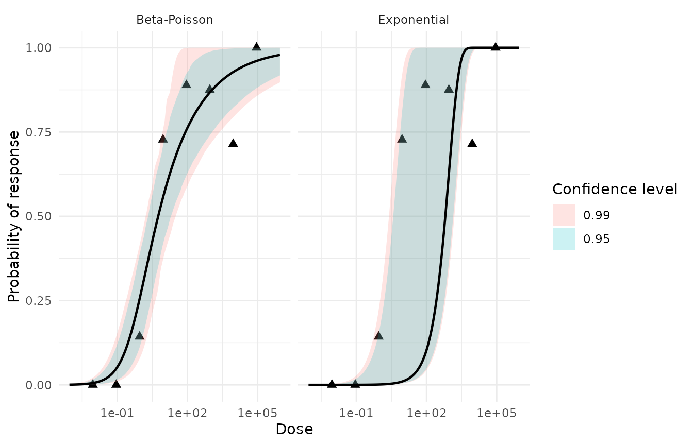
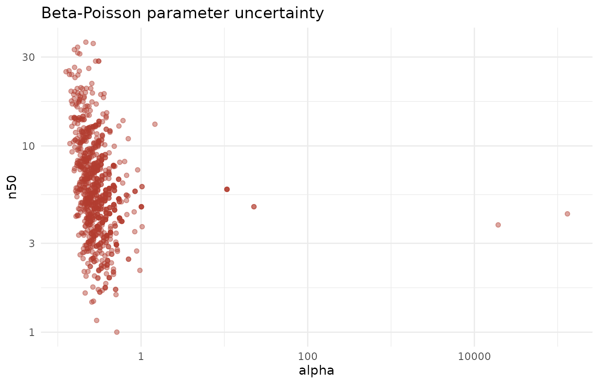

# Getting started: a start-to-finish dose-response walkthrough

This vignette walks the Ward rotavirus human-challenge data from raw
counts to a reported risk number, interpreting every output along the
way. It answers two questions an end user actually has: *what does my
data need to look like going in*, and *what are the results saying
coming out*.

``` r

library(singlehit)
```

## Load

The analysis needs **three columns, one row per dose group**: the
administered `dose`, and the numbers of subjects who did (`positive`)
and did not (`negative`) respond. The package ships this exact shape as
`ward_rotavirus`:

``` r

data(ward_rotavirus)
ward_rotavirus
#>    dose positive negative
#> 1 9e+04        3        0
#> 2 9e+03        5        2
#> 3 9e+02        7        1
#> 4 9e+01        8        1
#> 5 9e+00        8        3
#> 6 9e-01        1        6
#> 7 9e-02        0        7
#> 8 9e-03        0        7
```

There are two ways in. The **in-memory** path standardizes a data frame
you already have:

``` r

ward <- as_dose_response(ward_rotavirus)
ward
#> # A tibble: 8 × 5
#>        dose positive negative total response
#>       <dbl>    <dbl>    <dbl> <dbl>    <dbl>
#> 1     0.009        0        7     7    0    
#> 2     0.09         0        7     7    0    
#> 3     0.9          1        6     7    0.143
#> 4     9            8        3    11    0.727
#> 5    90            8        1     9    0.889
#> 6   900            7        1     8    0.875
#> 7  9000            5        2     7    0.714
#> 8 90000            3        0     3    1
```

The **from-disk** path reads the same data from the bundled text file —
this is what you would use for your own delimited file:

``` r

ward_path <- system.file("extdata", "Ward_rotavirus.txt", package = "singlehit")
ward_from_file <- read_dose_response(ward_path)

identical(ward, ward_from_file)
#> [1] TRUE
```

Both routes produce the standardized
`dose · positive · negative · total · response` tibble, where
`total = positive + negative` and `response = positive / total`. Column
names are auto-detected case- and punctuation-insensitively (`pos`,
`positive_response`, etc.); override detection with
`as_dose_response(data, dose =, positive =, negative =)`. Rows sharing a
dose are summed. Fitting requires **at least 3 distinct doses** and
**more than 1 total positive response** — non-conforming data is
rejected with an explanatory error.

## Run

[`analyze_dose_response()`](https://seanthimons.github.io/singlehit/reference/analyze_dose_response.md)
does everything in one call: trend test, model fits, diagnostics,
comparison, assessment, and bootstrap uncertainty. A fixed `seed` makes
the bootstrap reproducible.

``` r

analysis <- analyze_dose_response(
  ward,
  bootstrap_times = 1000, # reduced for a fast vignette build; the default is 10000
  resample = "observed",
  seed = 2026
)

analysis
#> <qdr_analysis> microbial dose-response analysis
#> Trend: Z = 5.036, one-sided p = 2.38e-07
#> 
#> Model assessment:
#> # A tibble: 2 × 3
#>   model        recommendation  conclusion                                       
#>   <chr>        <chr>           <chr>                                            
#> 1 beta_poisson recommended     Beta-Poisson shows an adequate fit and is prefer…
#> 2 exponential  not_recommended Exponential does not show an adequate fit and is…
#> 
#> Model comparison:
#> # A tibble: 2 × 19
#>   model    parameters converged log_lik deviance   AIC   BIC delta_AIC delta_BIC
#>   <chr>         <int> <lgl>       <dbl>    <dbl> <dbl> <dbl>     <dbl>     <dbl>
#> 1 beta_po…          2 TRUE        -8.69     6.82  21.4  25.5        0         0 
#> 2 exponen…          1 TRUE       -72.6    135.   147.  149.       126.      124.
#> # ℹ 10 more variables: deviance_difference <dbl>, chi_square_df <int>,
#> #   chi_square_critical <dbl>, chi_square_p_value <dbl>,
#> #   significant_improvement <lgl>, preferred <lgl>, preferred_by_AIC <lgl>,
#> #   preferred_by_BIC <lgl>, selection <chr>, conclusion <chr>
#> 
#> Bootstrap replicates per model: 1000
```

The rest of this vignette unpacks each component of that `qdr_analysis`
object.

## Interpret each output

### Trend — is there a dose-response signal at all?

``` r

analysis$trend
#> # A tibble: 1 × 5
#>   statistic     p_value alpha passes alternative
#>       <dbl>       <dbl> <dbl> <lgl>  <chr>      
#> 1      5.04 0.000000238  0.05 TRUE   increasing
```

[`dose_trend_test()`](https://seanthimons.github.io/singlehit/reference/dose_trend_test.md)
runs a one-sided log-dose trend test. `passes = TRUE` means a
**monotonic increasing** dose-response relationship was detected —
response rises with dose.

> **What this is really saying:** if `passes` were `FALSE`, there is no
> upward dose-response signal to model, and fitting mechanistic curves
> would not be warranted. Here it passes, so we proceed.

### Goodness of fit — does each model fit the data at all?

``` r

analysis$goodness_of_fit
#> # A tibble: 2 × 8
#>   model    deviance    df critical_value  p_value good_fit assessment conclusion
#>   <chr>       <dbl> <int>          <dbl>    <dbl> <lgl>    <chr>      <chr>     
#> 1 exponen…   135.       7           14.1 6.92e-26 FALSE    inadequate Exponenti…
#> 2 beta_po…     6.82     6           12.6 3.38e- 1 TRUE     adequate   Beta-Pois…
```

This is the **absolute** check. Each model’s `deviance` is compared
against a chi-squared `critical_value`; `good_fit` is `TRUE` when the
deviance falls below it (equivalently, `p_value` \> 0.05). `assessment`
records `adequate` or `inadequate`.

> **What this is really saying:** does this model describe the data
> acceptably on its own terms? A model can “win” a comparison and still
> fit badly — this is the gate that catches that.

### Comparison — which model wins, and did the extra parameter earn its keep?

``` r

analysis$comparison
#> # A tibble: 2 × 19
#>   model    parameters converged log_lik deviance   AIC   BIC delta_AIC delta_BIC
#>   <chr>         <int> <lgl>       <dbl>    <dbl> <dbl> <dbl>     <dbl>     <dbl>
#> 1 beta_po…          2 TRUE        -8.69     6.82  21.4  25.5        0         0 
#> 2 exponen…          1 TRUE       -72.6    135.   147.  149.       126.      124.
#> # ℹ 10 more variables: deviance_difference <dbl>, chi_square_df <int>,
#> #   chi_square_critical <dbl>, chi_square_p_value <dbl>,
#> #   significant_improvement <lgl>, preferred <lgl>, preferred_by_AIC <lgl>,
#> #   preferred_by_BIC <lgl>, selection <chr>, conclusion <chr>
```

This is the **relative** check. The two-parameter Beta-Poisson is tested
against the one-parameter Exponential (its nested limiting case) via the
`deviance_difference` on the extra degree of freedom, alongside
`AIC`/`BIC` and their deltas. `significant_improvement` and `preferred`
flag the winner.

> **What this is really saying:** the Beta-Poisson always fits at least
> as well because it has an extra parameter — `significant_improvement`
> asks whether that extra flexibility bought a *statistically real*
> improvement, or just curve-fit noise.

### Assessment — the headline verdict

``` r

analysis$assessment[, c("model", "appropriate", "preferred", "recommendation", "conclusion")]
#> # A tibble: 2 × 5
#>   model        appropriate preferred recommendation  conclusion                 
#>   <chr>        <lgl>       <lgl>     <chr>           <chr>                      
#> 1 beta_poisson TRUE        TRUE      recommended     Beta-Poisson shows an adeq…
#> 2 exponential  FALSE       FALSE     not_recommended Exponential does not show …
```

`build_model_assessment()` fuses the absolute and relative checks into
one `recommendation` label per model:

- `recommended` — fits adequately **and** is preferred.
- `acceptable_alternative` — fits adequately but is not preferred.
- `preferred_but_inadequate` — preferred but does **not** fit adequately
  (a red flag: the “best” model is still wrong).
- `not_recommended` — neither.

> **What this is really saying:** this is the one row a risk assessor
> reads first. `recommended` means “use this model with confidence”; the
> `conclusion` column spells it out in plain language.

### Consensus — an experimental cross-check

``` r

consensus_model_decision(analysis)
#> # A tibble: 2 × 13
#>   model     chi_squared_vote AIC_vote BIC_vote votes consensus_selected decision
#>   <chr>     <lgl>            <lgl>    <lgl>    <int> <lgl>              <chr>   
#> 1 beta_poi… TRUE             TRUE     TRUE         3 TRUE               selected
#> 2 exponent… FALSE            FALSE    FALSE        0 FALSE              not_sel…
#> # ℹ 6 more variables: agreement <chr>, criteria_available <int>,
#> #   chi_squared_choice <chr>, AIC_choice <chr>, BIC_choice <chr>,
#> #   conclusion <chr>
```

[`consensus_model_decision()`](https://seanthimons.github.io/singlehit/reference/consensus_model_decision.md)
treats the chi-squared, AIC, and BIC selections as three votes and
reports the `agreement` level (`unanimous`, `majority`, or
`no_consensus`).

> **What this is really saying:** an experimental sanity check on the
> relative selection. It does **not** replace the absolute
> goodness-of-fit gate above — a unanimously-voted model can still fit
> inadequately.

### Bootstrap intervals — the final risk numbers and their uncertainty

``` r

bootstrap_confint(analysis$bootstraps$beta_poisson, levels = c(0.95))
#> # A tibble: 4 × 5
#>   model        term  level  lower  upper
#>   <chr>        <chr> <dbl>  <dbl>  <dbl>
#> 1 beta_poisson alpha  0.95 0.161   0.707
#> 2 beta_poisson ed10   0.95 0.0766  0.790
#> 3 beta_poisson ed50   0.95 2.06   19.6  
#> 4 beta_poisson n50    0.95 2.06   19.6
```

The bootstrap refits the model to resampled data many times and reports
percentile confidence intervals — not just for the parameters (`alpha`,
`n50`) but for the **effective doses** `ed10` and `ed50`: the doses
producing a 10% and 50% response.

> **What this is really saying:** these are the deliverable. `ed50` is
> the median infectious dose; its interval is the honest uncertainty
> around it, driven by how much data you have and how noisy it is.

## Plots

`autoplot()` on the analysis shows each fitted curve over the observed
points:

``` r

ggplot2::autoplot(analysis)
```



`autoplot()` on a bootstrap object shows the sampling distribution of
the fitted parameters — the visual form of the intervals above:

``` r

ggplot2::autoplot(analysis$bootstraps$beta_poisson)
```



## The final answer

Read the recommended model’s `ed50` and its interval, and you have the
number a risk assessor reports:

``` r

# Which model did the assessment recommend?
recommended <- analysis$assessment$model[analysis$assessment$recommendation == "recommended"][1]
recommended
#> [1] "beta_poisson"

# Its bootstrap intervals, then keep only the ed50 row.
ci <- bootstrap_confint(analysis$bootstraps[[recommended]], levels = c(0.95))
ci[ci$term == "ed50", ]
#> # A tibble: 1 × 5
#>   model        term  level lower upper
#>   <chr>        <chr> <dbl> <dbl> <dbl>
#> 1 beta_poisson ed50   0.95  2.06  19.6
```

That single row — the median infectious dose of the recommended model
with its 95% percentile interval — is the deliverable: *the dose at
which half of exposed subjects are expected to be infected, with a
defensible bound on how sure we are.*
